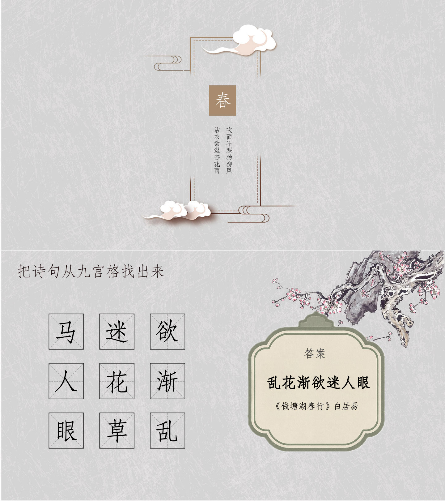
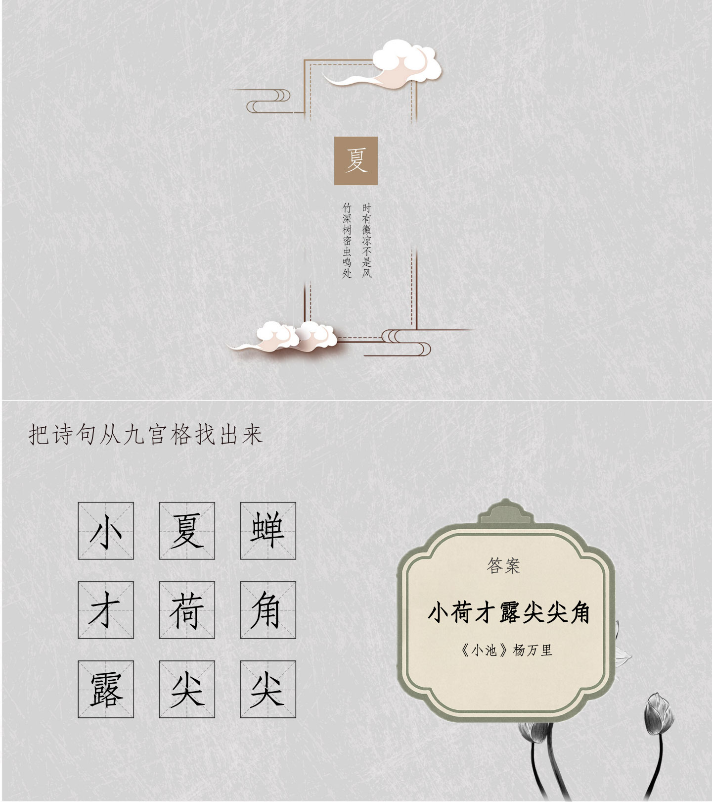
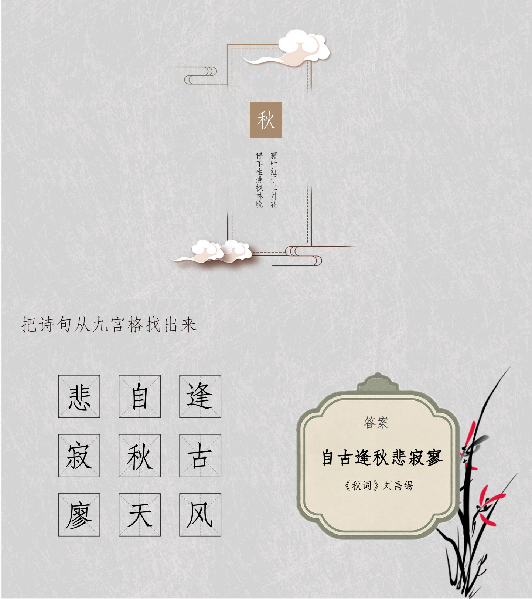
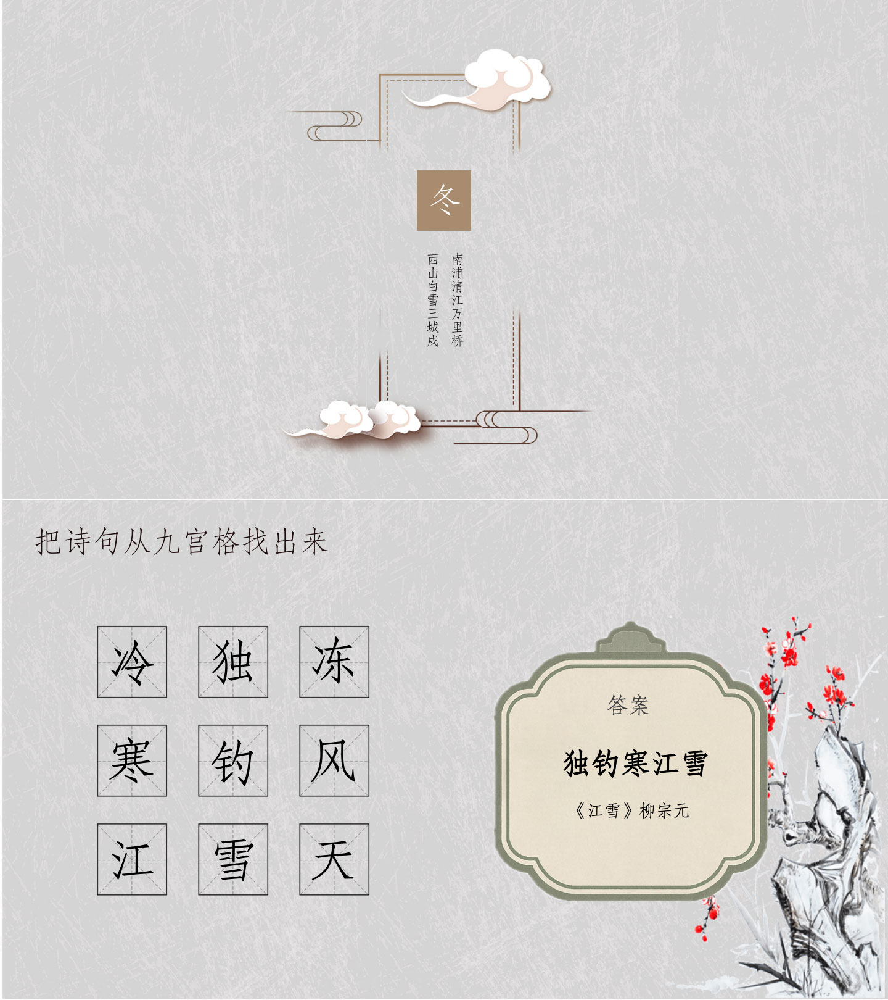

# 诗词串串游戏PPT

巨好玩的诗词九宫格游戏，规则简单，好玩到停不下来！语文老师必背的古诗词小游戏课件！

## 🎮 游戏规则

**🎯 游戏目标：** 将打散的诗词字符重新连接，还原完整的诗句。

**🎲 游戏规则：**

- 每句诗词的字符会被随机打散放置在3×3的九宫格中。找出正确的诗句！
- 如果想要提高难度，找出诗句之后，要求玩家说出诗句的出处，并背诵全诗。

**🎈 适用场景：** 语文课、班会课、学校诗词大会、公司年会、团建游戏等。

## 📄 PPT模板

精美的模板，内置题库，可直接下载使用。诗词内容可编辑，可轻松添加自己想要的诗词。

- [📥 下载PPT模板](/public/pptx/诗词串串.pptx?raw=true)

**📸 模板预览：**

## 🚀 PPT生成器

**在线工具：** [PPT生成器](https://oonne.github.io/poetry-strands-ppt/)

**功能特点：**

- 可自定义诗词内容，一键生成PPT。
- 每句诗词最多使用前9个字符，空白行将被忽略。

**使用方法：**

1. 在输入框中输入诗句（每句最多9个字符）
2. 点击"添加诗词"可增加更多诗句
3. 点击"生成PPT"自动生成并下载PPT文件

## 关于

**作者：** [工程师加一](https://blog.oonne.com)

扫码或微信搜索"诗词串串"，挑战更多诗词！

